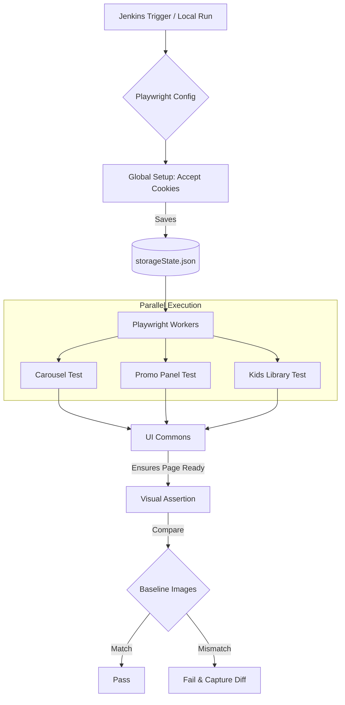
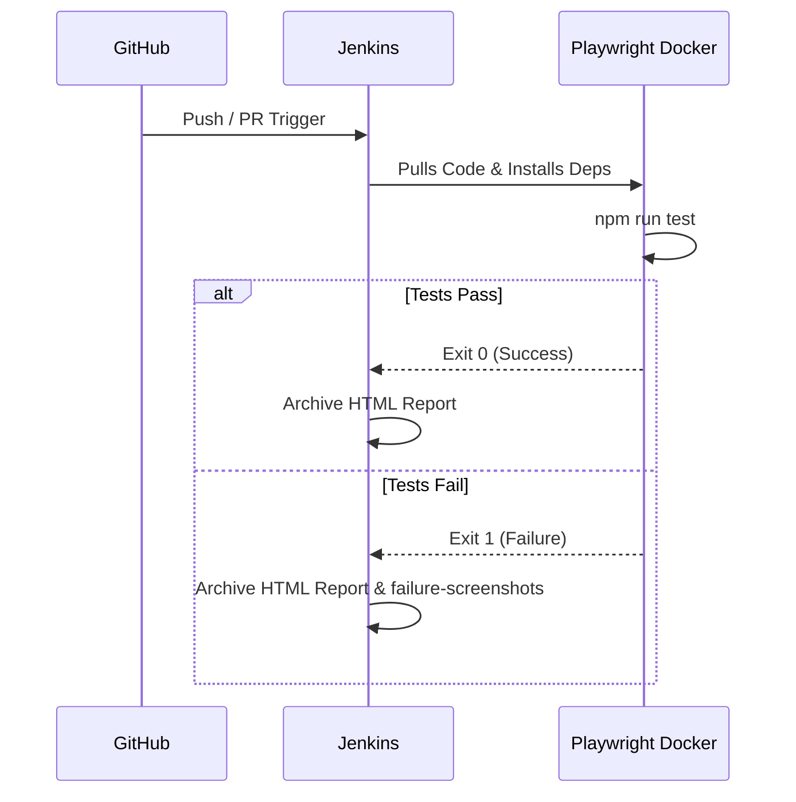
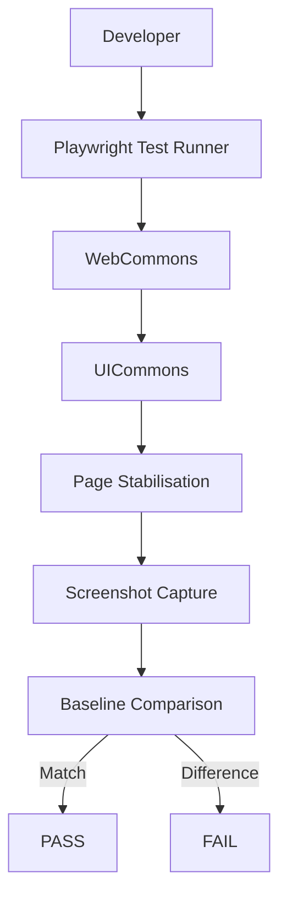

<div align="center">
  
  

  <h1>M&G UI Automation Framework</h1>
  <p><i>A high-performance, visually-driven testing framework powered by Playwright</i></p>
</div>

---

This repository contains the official UI automation framework used for validating and performing visual regression testing on M&G's bespoke web components.

## 🌟 Framework Overview

The framework is designed to capture, compare, and validate pixel-perfect screenshots of 55+ UI components across multiple viewports (Desktop, Tablet, Mobile) and browsers (Chromium, WebKit). 

### Key Capabilities:
- **Visual Regression Testing**: Automated baseline comparisons to detect any visual UI anomalies.
- **Global Authentication Setup**: Instantly bypasses the OneTrust Cookie Banner for all tests using shared browser state.
- **Tag-Based Execution**: Run specific modules or bespoke components dynamically.
- **Robust Wait Strategies**: Custom `UICommons` wrappers that ensure elements (like carousels and images) are fully loaded before capturing snapshots.
- **Continuous Integration (CI/CD)**: Deeply integrated with Jenkins for automated, nightly, or PR-based validations.

---

## 🏗️ Architecture & Component Flow



### 📂 Directory Structure

```text
mandg-UI-framework/
├── assets/                  # Documentation assets (like the banner above)
├── BaseLineImages/          # The 'source of truth' screenshots for visual testing
├── commons/
│   └── ui/                  # Helper classes (web-commons.ts, ui-commons.ts)
├── config/                  # Configuration JSON files (components-url.json)
├── page-objects/            # Page Elements and Step definitions
├── tests/
│   ├── global-setup.ts      # The script that authenticates the browser globally
│   └── ui/
│       └── component-ui.spec.ts # The primary test suite containing all components
├── playwright.config.ts     # Playwright orchestration and viewport definitions
└── Jenkinsfile              # Declarative CI/CD pipeline definition
```

---

## 🚀 Getting Started

### 1. Prerequisites
Ensure you have the following installed on your machine:
- [Node.js](https://nodejs.org/) (v18+)
- Git

### 2. Installation
Clone the repository and install the dependencies:
```bash
git clone https://github.com/bm13gitfiles/mandg-UI-framework.git
cd mandg-UI-framework
npm ci
```

If this is your first time running Playwright on this machine, install the required browsers:
```bash
npx playwright install --with-deps
```

---

## 💻 Execution Guide

We have exposed several simple NPM commands to make running your tests incredibly easy.

| Command | Action |
| :--- | :--- |
| `npm run test` | Runs the entire suite of 275+ tests in headless mode. |
| `npm run test:ui` | Opens the **Playwright UI**, allowing you to time-travel through test steps and visually debug failures. |
| `npm run test:update` | Replaces all `BaseLineImages` with new snapshots. Run this *only* when a UI change is intentional and approved. |
| `npm run test:tag -- "@Carousel"`| Runs only the specific component tagged with `@Carousel`. |
| `npm run report` | Serves the HTML report locally after a test run. |

---

## 🧠 Core Concepts

### Global Setup
Instead of having every single test navigate to the application and manually accept the OneTrust Cookie Banner (which wastes time), the framework uses a `global-setup.ts` file. Playwright runs this file **once** before the test suite begins. It logs in, accepts the cookies, and saves the browser session into `storageState.json`. Every test then instantly launches with those cookies already injected.

### Stability Logic (`UICommons`)
UI testing is prone to flakiness due to dynamic images, lazy-loading, and animations. Our `UICommons.ts` file provides specific wait wrappers:
- `waitForStableHeight`: Ensures the DOM is no longer shifting.
- `ensurePageReadyForTesting`: A non-blocking `Promise.all` approach to wait for all network requests and visual elements to settle before a screenshot is taken.

---

## 🔄 CI/CD Integration (Jenkins)

The included `Jenkinsfile` allows you to plug this framework directly into Jenkins.



To configure in Jenkins:
1. Create a **Pipeline** job.
2. Select **Pipeline script from SCM**.
3. Choose **Git** and point it to this repository.
4. Ensure your Jenkins credentials (PAT) are attached.

Jenkins will automatically handle retries (up to 2 times for flaky tests) because the `CI='true'` flag is passed directly to `playwright.config.ts`.

---

## ✨ Why This Framework?

Traditional UI testing solutions often require external services, proprietary tooling, or additional infrastructure to perform visual regression testing.

The M&G UI Automation Framework is built entirely on Playwright, providing a lightweight, deterministic, and fully local solution for validating bespoke web components.

### Benefits
- 🚀 **Zero third-party dependencies** for visual comparison
- 📷 **Native Playwright screenshot engine**
- 🌐 **Cross-browser support** (Chromium, Firefox & WebKit)
- 📱 **Responsive testing** across Desktop, Tablet and Mobile
- ⚡ **Parallel execution** for faster feedback
- 🔍 **Pixel-perfect visual regression**
- 🔄 **Fully CI/CD compatible**
- 🧩 **Easily extensible** using reusable helper methods (UICommons)
- 💻 **Runs identically** on local machines and build agents

---

## 🎯 Why Playwright Visual Testing?

Unlike traditional screenshot comparison tools, this framework relies on Playwright's native visual comparison engine.

### Advantages
| Capability | This Framework |
| :--- | :---: |
| Native browser rendering | ✅ |
| Pixel-perfect comparison | ✅ |
| Cross-browser testing | ✅ |
| Parallel execution | ✅ |
| No external cloud dependency | ✅ |
| Works offline | ✅ |
| No additional licensing | ✅ |
| Full control over tolerances | ✅ |
| Easily debuggable | ✅ |

---

## 📊 Framework Comparison

| Feature | This Framework | AET | Applitools |
| :--- | :---: | :---: | :---: |
| Built on Playwright | ✅ | ❌ | Partial |
| Native browser screenshots | ✅ | ❌ | ❌ |
| Pixel-perfect comparison | ✅ | ⚠️ | ❌ (AI-based) |
| Cross-browser support | ✅ | Limited | ✅ |
| Parallel execution | ✅ | Limited | ✅ |
| Runs locally | ✅ | ⚠️ | ⚠️ |
| No external cloud | ✅ | ✅ | ❌ |
| Open-source stack | ✅ | ⚠️ | ❌ |
| CI/CD ready | ✅ | ✅ | ✅ |
| Visual helper library | ✅ | ❌ | ❌ |
| Lazy-loading handling | ✅ | ❌ | ❌ |
| Sticky element stabilisation | ✅ | ❌ | ❌ |
| Custom component preparation | ✅ | ❌ | ❌ |
| **Cost** | **Free** | **Free** | **Commercial** |

---

## 🛠️ Advanced Stability Features

Visual testing becomes unreliable when pages contain dynamic content such as:
- Lazy-loaded videos
- Flourish stories
- Carousels
- Sticky components
- Animations
- Asynchronously loaded images

The framework provides a growing library of reusable helpers to eliminate test flakiness. Examples include:
- `ensurePageReadyForTesting()`
- `waitForStableHeight()`
- `preparePageForFullPageScreenshot()`
- `freezeStickyElement()`
- `stubFlourishStories()`
- `forceElementVisible()`
- `loadLazyIframes()`

These utilities make screenshots deterministic across supported browsers and responsive viewports.

---

## 📈 Framework Statistics

Current implementation includes:

| Metric | Value |
| :--- | :--- |
| **Components Covered** | 55+ |
| **Visual Test Cases** | 275+ |
| **Supported Browsers** | 3 (Chromium, WebKit, Firefox) |
| **Supported Viewports** | 3 (Desktop, Tablet, Mobile) |
| **Baseline Images** | 800+ |
| **Parallel Workers** | Configurable |
| **Jenkins Ready** | ✅ |

---

## 🧩 Framework Design



---

## 🔍 Why Not AI-Based Visual Testing?

This framework intentionally performs **pixel-level visual comparison** rather than AI-assisted comparison.

For UI component validation, every single pixel matters. Examples of defects detected include:
- Incorrect spacing
- Missing images
- Font regressions
- Alignment issues
- Colour changes
- Unexpected CSS changes
- Layout shifts
- Missing components

Because comparisons are deterministic, failures are reproducible across local execution and CI pipelines.
