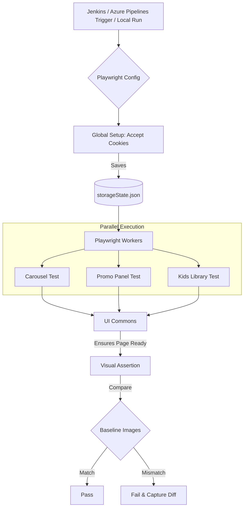
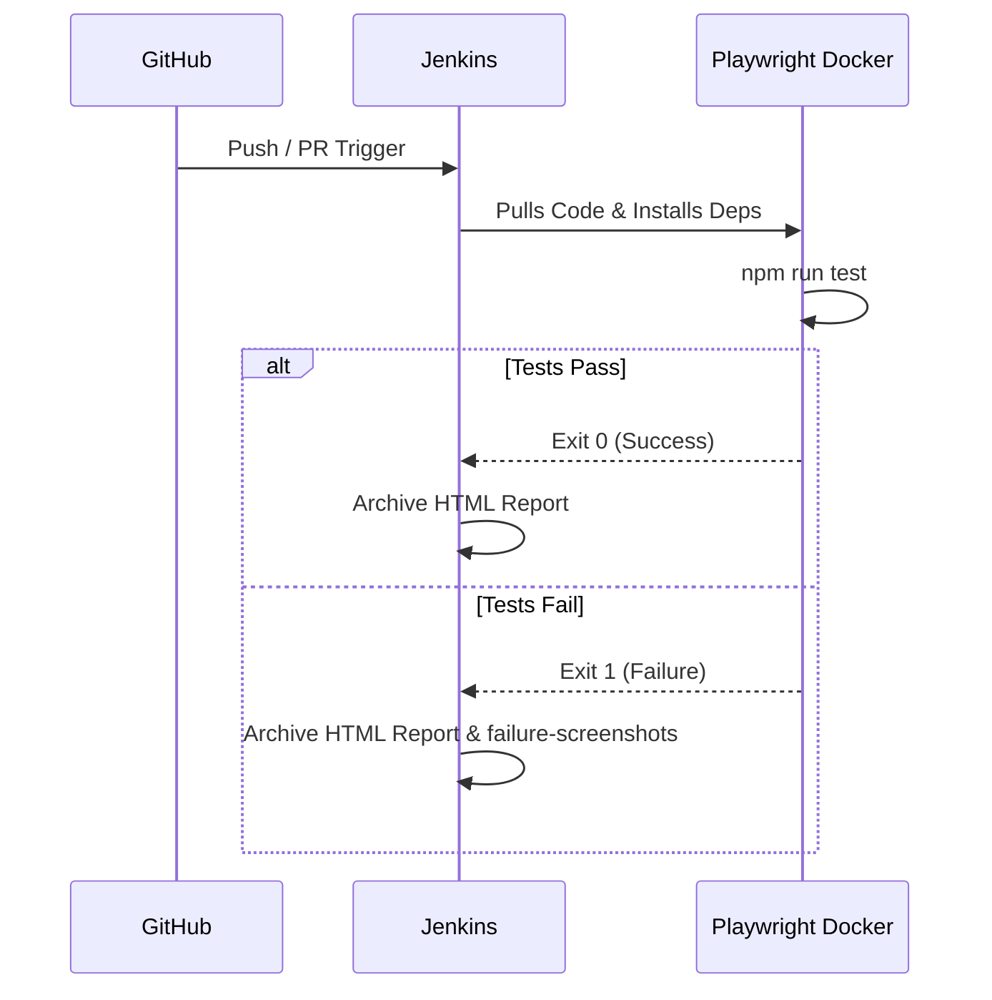
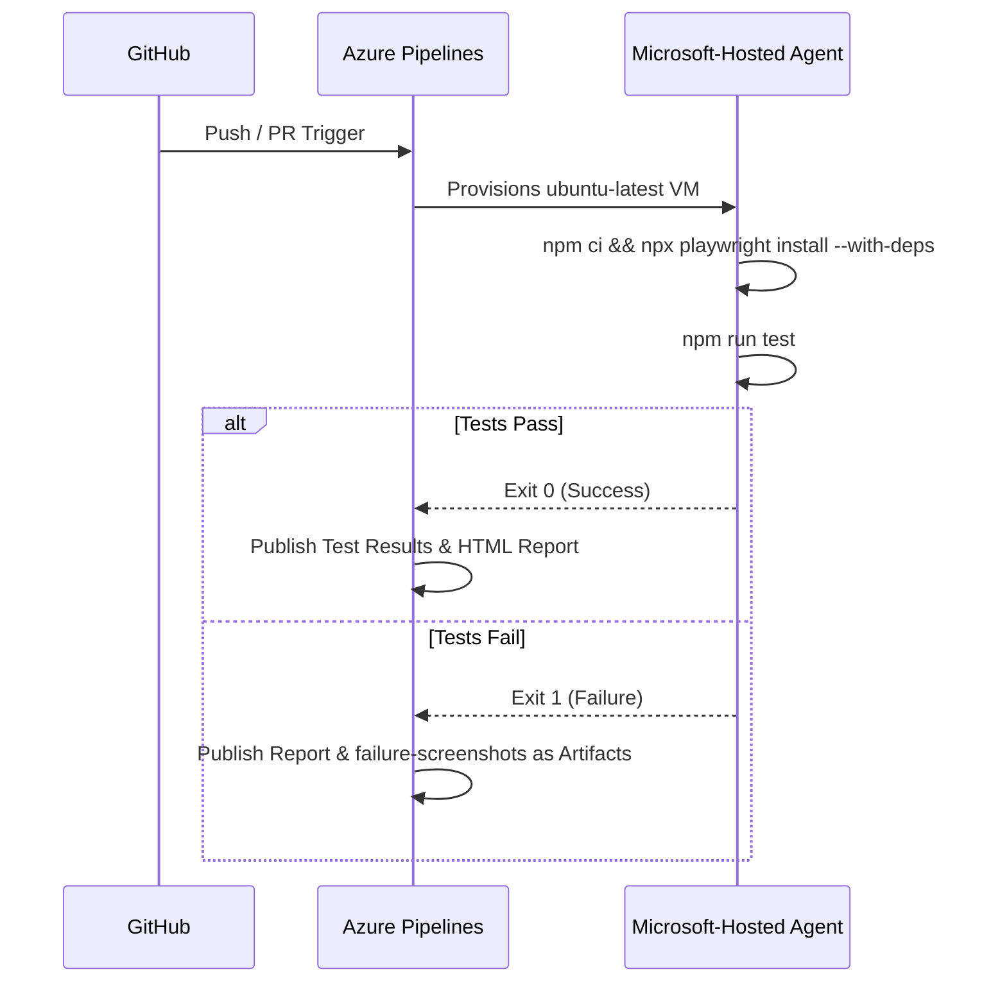
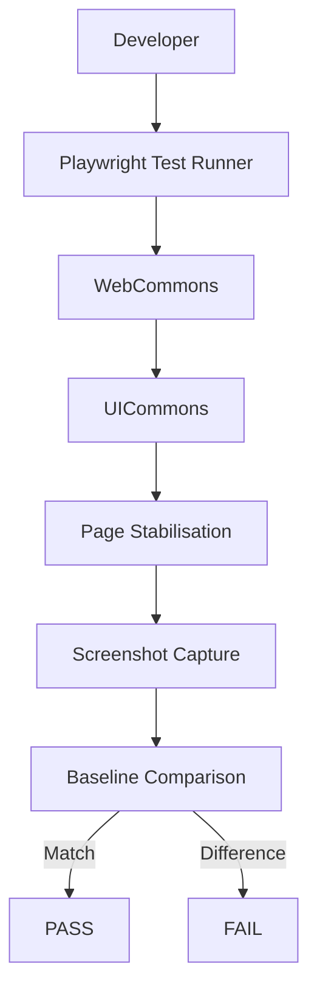

<div align="center">
  

  <h1>M&G UI Automation Framework</h1>
  <p><i>A high-performance, visually-driven testing framework powered by Playwright</i></p>

  <p>
    
  </p>

  <p>
    <a href="https://github.com/bm13gitfiles/mandg-UI-framework/stargazers"></a>
    <a href="https://github.com/bm13gitfiles/mandg-UI-framework/network/members"></a>
    <a href="https://github.com/bm13gitfiles/mandg-UI-framework/commits/main"></a>
    
    
    
  </p>

  <p>
    <a href="https://github.com/bm13gitfiles/mandg-UI-framework"><b>View on GitHub</b></a>
  </p>
</div>

---

## 📖 Table of Contents

- [Overview](#-framework-overview)
- [Architecture & Component Flow](#️-architecture--component-flow)
- [Directory Structure](#-directory-structure)
- [Getting Started](#-getting-started)
- [Execution Guide](#-execution-guide)
- [Core Concepts](#-core-concepts)
- [CI/CD Integration — Jenkins](#-cicd-integration-jenkins)
- [CI/CD Integration — Azure DevOps](#-cicd-integration-azure-devops)
- [Advanced Stability Features](#️-advanced-stability-features)
- [Framework Statistics](#-framework-statistics)
- [Why This Framework?](#-why-this-framework)
- [Why Not AI-Based Visual Testing?](#-why-not-ai-based-visual-testing)

---

## 🌟 Framework Overview

This repository contains the official UI automation framework used for validating and performing **visual regression testing** on M&G's bespoke web components.

The framework is designed to capture, compare, and validate pixel-perfect screenshots of **55+ UI components** across **5 distinct viewports** (Large Desktop, 960px Desktop, Mac Safari Desktop, Tablet, Mobile) and browsers (Chromium, WebKit).

### Key Capabilities

| Capability | Description |
| :--- | :--- |
| 🖼️ **Visual Regression Testing** | Automated baseline comparisons to detect any visual UI anomalies |
| 🔐 **Global Authentication Setup** | Instantly bypasses the OneTrust Cookie Banner for all tests using shared browser state |
| 🏷️ **Tag-Based Execution** | Run specific modules or bespoke components dynamically |
| ⏱️ **Robust Wait Strategies** | Custom `UICommons` wrappers that ensure elements (like carousels and images) are fully loaded before capturing snapshots |
| 🔄 **Continuous Integration (CI/CD)** | Deeply integrated with **Jenkins** and **Azure DevOps** for automated, nightly, or PR-based validations |
| 🐳 **Containerised Execution** | Ships with a `Dockerfile` so tests run identically on any machine or build agent |

---

## 🏗️ Architecture & Component Flow



---

## 📂 Directory Structure

```text
mandg-UI-framework/
├── assets/                              # Documentation assets (like the banner above)
├── BaseLineImages/                      # The 'source of truth' screenshots for visual testing
│   └── ui/component-ui.spec.ts-snapshots
├── backup-reports/                      # Archived HTML report runs
├── commons/
│   └── ui/                              # Helper classes (web-commons.ts, ui-commons.ts)
├── config/                              # Configuration JSON files (components-url.json)
├── failure-screenshots/                 # Captured diffs from failed runs
├── page-objects/                        # Page Elements and Step definitions
├── reports/                             # Latest HTML test report
├── tests/
│   ├── global-setup.ts                  # The script that authenticates the browser globally
│   └── ui/
│       └── component-ui.spec.ts         # The primary test suite containing all components
├── Dockerfile                           # Containerised execution environment
├── Jenkinsfile                          # Declarative Jenkins CI/CD pipeline
├── azure-pipelines.yml                  # Azure DevOps CI/CD pipeline
├── playwright.config.ts                 # Playwright orchestration and viewport definitions
├── tsconfig.json                        # TypeScript configuration
└── vscode-extensions.txt                # Recommended VS Code extensions for contributors
```

---

## 🚀 Getting Started

### 1. Prerequisites

Ensure you have the following installed on your machine:

- [Node.js](https://nodejs.org/) (v18+)
- Git

### 2. Installation

Clone the repository and install the dependencies:

```bash
git clone https://github.com/bm13gitfiles/mandg-UI-framework.git
cd mandg-UI-framework
npm ci
```

If this is your first time running Playwright on this machine, install the required browsers:

```bash
npx playwright install --with-deps
```

> 💡 **Tip:** Run `npx playwright install --with-deps` again after any Playwright version bump to keep browser binaries in sync.

### 3. Running via Docker (optional)

The repo ships with a `Dockerfile`, so you can run the full suite in a container without installing anything locally:

```bash
docker build -t mandg-ui-framework .
docker run --rm mandg-ui-framework npm run test
```

---

## 💻 Execution Guide

We have exposed several simple NPM commands to make running your tests incredibly easy.

| Command | Action |
| :--- | :--- |
| `npm run test` | Runs the entire suite of 275+ tests in headless mode |
| `npm run test:ui` | Opens the **Playwright UI**, allowing you to time-travel through test steps and visually debug failures |
| `npm run test:update` | Replaces all `BaseLineImages` with new snapshots. Run this *only* when a UI change is intentional and approved |
| `npm run test:tag -- "@Carousel"` | Runs only the specific component tagged with `@Carousel` |
| `npm run report` | Serves the HTML report locally after a test run |

---

## 🧠 Core Concepts

### Global Setup

Instead of having every single test navigate to the application and manually accept the OneTrust Cookie Banner (which wastes time), the framework uses a `global-setup.ts` file. Playwright runs this file **once** before the test suite begins. It logs in, accepts the cookies, and saves the browser session into `storageState.json`. Every test then instantly launches with those cookies already injected.

### Stability Logic (`UICommons`)

UI testing is prone to flakiness due to dynamic images, lazy-loading, and animations. Our `UICommons.ts` file provides specific wait wrappers:

- `waitForStableHeight` — Ensures the DOM is no longer shifting
- `ensurePageReadyForTesting` — A non-blocking `Promise.all` approach to wait for all network requests and visual elements to settle before a screenshot is taken

---

## 🔄 CI/CD Integration (Jenkins)

The included `Jenkinsfile` allows you to plug this framework directly into Jenkins.



### Configuring in Jenkins

1. Create a **Pipeline** job.
2. Select **Pipeline script from SCM**.
3. Choose **Git** and point it to this repository.
4. Ensure your Jenkins credentials (PAT) are attached.

> ⚙️ Jenkins will automatically handle retries (up to 2 times for flaky tests) because the `CI='true'` flag is passed directly to `playwright.config.ts`.

---

## ☁️ CI/CD Integration (Azure DevOps)

This framework can just as easily be triggered from **Azure Pipelines**, giving you a second, cloud-native option alongside Jenkins.



### `azure-pipelines.yml`

Add a file named `azure-pipelines.yml` to the repository root with something like the following as a starting point:

```yaml
trigger:
  branches:
    include:
      - main

pr:
  branches:
    include:
      - main

pool:
  vmImage: 'ubuntu-latest'

steps:
  - task: NodeTool@0
    inputs:
      versionSpec: '18.x'
    displayName: 'Install Node.js'

  - script: npm ci
    displayName: 'Install dependencies'

  - script: npx playwright install --with-deps
    displayName: 'Install Playwright browsers'

  - script: npm run test
    displayName: 'Run visual regression suite'
    env:
      CI: 'true'

  - task: PublishTestResults@2
    condition: succeededOrFailed()
    inputs:
      testResultsFormat: 'JUnit'
      testResultsFiles: '**/results.xml'
    displayName: 'Publish test results'

  - task: PublishPipelineArtifact@1
    condition: succeededOrFailed()
    inputs:
      targetPath: 'reports'
      artifact: 'playwright-html-report'
    displayName: 'Publish HTML report'

  - task: PublishPipelineArtifact@1
    condition: failed()
    inputs:
      targetPath: 'failure-screenshots'
      artifact: 'failure-screenshots'
    displayName: 'Publish failure screenshots'
```

### Configuring in Azure DevOps

1. In your Azure DevOps project, go to **Pipelines → New Pipeline**.
2. Select **GitHub** as the source and authorise access to `bm13gitfiles/mandg-UI-framework`.
3. Choose **Existing Azure Pipelines YAML file** and point it to `/azure-pipelines.yml`.
4. Save and run — subsequent pushes and PRs to `main` will trigger automatically.

> 🔁 Like the Jenkins setup, the `CI='true'` environment variable is passed to `playwright.config.ts` so retries and reporter settings behave consistently across both CI providers.

---

## 🛠️ Advanced Stability Features

Visual testing becomes unreliable when pages contain dynamic content such as:

- Lazy-loaded videos
- Flourish stories
- Carousels
- Sticky components
- Animations
- Asynchronously loaded images

The framework provides a growing library of reusable helpers to eliminate test flakiness:

| Helper | Purpose |
| :--- | :--- |
| `ensurePageReadyForTesting()` | Waits for network and visual elements to settle |
| `waitForStableHeight()` | Confirms the DOM has stopped shifting |
| `preparePageForFullPageScreenshot()` | Preps the page for a clean full-page capture |
| `freezeStickyElement()` | Pins sticky/fixed elements to avoid scroll artifacts |
| `stubFlourishStories()` | Replaces Flourish embeds with a stable placeholder |
| `forceElementVisible()` | Forces hidden/lazy elements into view for capture |
| `loadLazyIframes()` | Triggers lazy-loaded iframes ahead of the snapshot |

These utilities make screenshots deterministic across supported browsers and responsive viewports.

---

## 📈 Framework Statistics

| Metric | Value |
| :--- | :--- |
| **Components Covered** | 55+ |
| **Visual Test Cases** | 275+ |
| **Supported Browsers** | 3 (Chromium, WebKit, Firefox) |
| **Supported Viewports** | 5 (Large Desktop, 960px Desktop, Safari Desktop, Tablet, Mobile) |
| **Baseline Images** | 800+ |
| **Parallel Workers** | Configurable |
| **Jenkins Ready** | ✅ |
| **Azure DevOps Ready** | ✅ |
| **Docker Ready** | ✅ |

---

## ✨ Why This Framework?

Traditional UI testing solutions often require external services, proprietary tooling, or additional infrastructure to perform visual regression testing.

The M&G UI Automation Framework is built entirely on Playwright, providing a lightweight, deterministic, and fully local solution for validating bespoke web components.

### Benefits

- 🚀 Zero third-party dependencies for visual comparison
- 📷 Native Playwright screenshot engine
- 🌐 Cross-browser support (Chromium, Firefox & WebKit)
- 📱 Responsive testing across Desktop, Tablet and Mobile
- ⚡ Parallel execution for faster feedback
- 🔍 Pixel-perfect visual regression
- 🔄 Fully CI/CD compatible — **Jenkins and Azure DevOps out of the box**
- 🧩 Easily extensible using reusable helper methods (`UICommons`)
- 💻 Runs identically on local machines, containers, and build agents

### Advantages Over Traditional Tools

| Capability | This Framework |
| :--- | :---: |
| Native browser rendering | ✅ |
| Pixel-perfect comparison | ✅ |
| Cross-browser testing | ✅ |
| Parallel execution | ✅ |
| No external cloud dependency | ✅ |
| Works offline | ✅ |
| No additional licensing | ✅ |
| Full control over tolerances | ✅ |
| Easily debuggable | ✅ |

### Framework Comparison

| Feature | This Framework | AET | Applitools |
| :--- | :---: | :---: | :---: |
| Built on Playwright | ✅ | ❌ | Partial |
| Native browser screenshots | ✅ | ❌ | ❌ |
| Pixel-perfect comparison | ✅ | ⚠️ | ❌ (AI-based) |
| Cross-browser support | ✅ | Limited | ✅ |
| Parallel execution | ✅ | Limited | ✅ |
| Runs locally | ✅ | ⚠️ | ⚠️ |
| No external cloud | ✅ | ✅ | ❌ |
| Open-source stack | ✅ | ⚠️ | ❌ |
| CI/CD ready (Jenkins + Azure DevOps) | ✅ | ✅ | ✅ |
| Visual helper library | ✅ | ❌ | ❌ |
| Lazy-loading handling | ✅ | ❌ | ❌ |
| Sticky element stabilisation | ✅ | ❌ | ❌ |
| Custom component preparation | ✅ | ❌ | ❌ |
| **Cost** | **Free** | **Free** | **Commercial** |

---

## 🧩 Framework Design



---

## 🔍 Why Not AI-Based Visual Testing?

This framework intentionally performs **pixel-level visual comparison** rather than AI-assisted comparison.

For UI component validation, every single pixel matters. Examples of defects detected include:

- Incorrect spacing
- Missing images
- Font regressions
- Alignment issues
- Colour changes
- Unexpected CSS changes
- Layout shifts
- Missing components

Because comparisons are deterministic, failures are reproducible across local execution and CI pipelines.

---

<div align="center">
  <sub>Built with ❤️ and Playwright by Balu Mahendran M</sub>
</div>