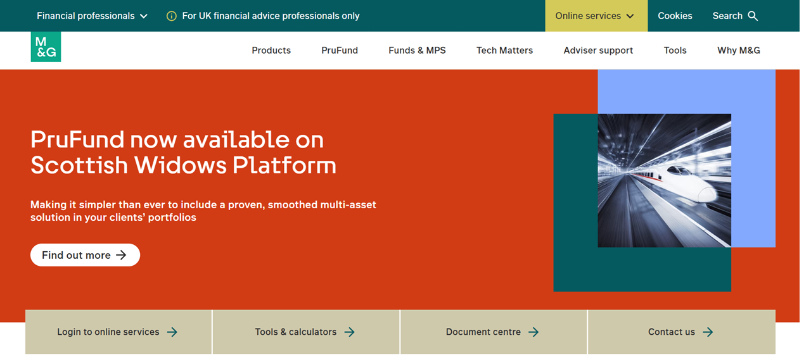
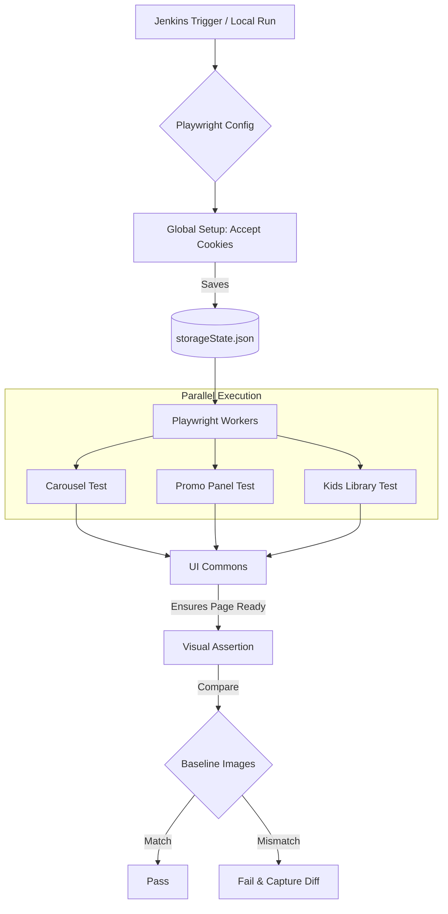
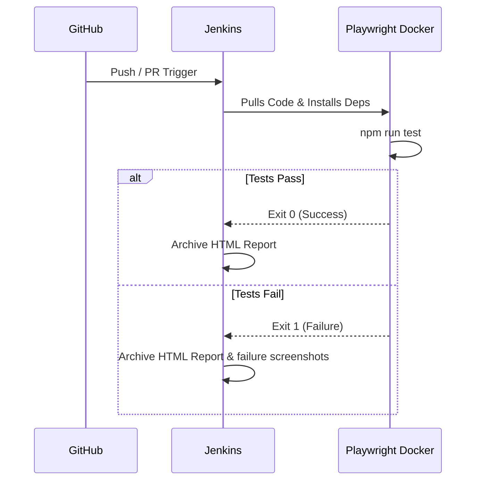

<div align="center">
  
  

  <h1>M&G UI Automation Framework</h1>
  <p><i>A high-performance, visually-driven testing framework powered by Playwright</i></p>
</div>

---

This repository contains the official UI automation framework used for validating and performing visual regression testing on M&G's bespoke web components.

## 🌟 Framework Overview

The framework is designed to capture, compare, and validate pixel-perfect screenshots of **56+ bespoke UI components** across **5 responsive viewport profiles** and multiple browser engines (Chromium, Firefox and WebKit).

Every component is automatically validated across:

- 🖥️ Large Desktop
- 💻 Standard Desktop (960px Responsive)
- 🍎 Mac Safari Desktop
- 📱 Tablet
- 📱 Mobile

This ensures a consistent user experience across all supported browsers and devices while detecting even the smallest visual regressions before they reach production.

### Key Capabilities:

- **Visual Regression Testing**: Automated baseline comparisons to detect any visual UI anomalies.
- **5 Viewport Responsive Validation**: Every component is validated across Large Desktop, Standard Desktop (960px), Mac Safari Desktop, Tablet and Mobile to ensure responsive consistency.
- **Cross Browser Testing**: Supports Chromium, Firefox and WebKit rendering engines.
- **Global Authentication Setup**: Instantly bypasses the OneTrust Cookie Banner for all tests using shared browser state.
- **Tag-Based Execution**: Run specific modules or bespoke components dynamically.
- **Robust Wait Strategies**: Custom `UICommons` wrappers that ensure elements (videos, Flourish embeds, carousels, images and lazy-loaded content) are fully loaded before capturing snapshots.
- **Reusable Visual Helpers**: Purpose-built helper methods for handling sticky elements, lazy loading, page stabilisation and responsive rendering.
- **Parallel Execution**: Execute visual tests efficiently across multiple workers.
- **Continuous Integration (CI/CD)**: Deeply integrated with Jenkins for automated nightly, scheduled or pull request validations.

---

## 📱 Five Viewport Responsive Validation

Unlike traditional UI automation frameworks that validate only a single desktop viewport, this framework validates every bespoke component across **five predefined M&G viewport configurations**.

| Viewport | Purpose |
| :--- | :--- |
| 🖥️ Large Desktop | Primary desktop experience |
| 💻 Standard Desktop (960px) | Responsive desktop layout |
| 🍎 Mac Safari Desktop | Safari-specific rendering validation |
| 📱 Tablet | Tablet responsiveness |
| 📱 Mobile | Mobile responsiveness |

Testing each component across all five viewport profiles ensures:

- Responsive layouts remain visually consistent.
- Images and videos render correctly.
- Typography and spacing remain unchanged.
- Sticky components behave consistently.
- Browser-specific rendering issues are detected early.
- Mobile and tablet layouts are validated alongside desktop experiences.

---

## 🏗️ Architecture & Component Flow



### 📂 Directory Structure

```text
mandg-UI-framework/
├── assets/                  # Documentation assets (like the banner above)
├── BaseLineImages/          # The 'source of truth' screenshots for visual testing
├── commons/
│   └── ui/                  # Helper classes (web-commons.ts, ui-commons.ts)
├── config/                  # Configuration JSON files (components-url.json)
├── page-objects/            # Page Elements and Step definitions
├── tests/
│   ├── global-setup.ts      # The script that authenticates the browser globally
│   └── ui/
│       └── component-ui.spec.ts # The primary test suite containing all components
├── playwright.config.ts     # Playwright orchestration and viewport definitions
└── Jenkinsfile              # Declarative CI/CD pipeline definition
```

---

## 🚀 Getting Started

### 1. Prerequisites

Ensure you have the following installed on your machine:

- [Node.js](https://nodejs.org/) (v18+)
- Git

### 2. Installation

Clone the repository and install the dependencies:

```bash
git clone https://github.com/bm13gitfiles/mandg-UI-framework.git
cd mandg-UI-framework
npm ci
```

If this is your first time running Playwright on this machine, install the required browsers:

```bash
npx playwright install --with-deps
```

---

## 💻 Execution Guide

We have exposed several simple NPM commands to make running your tests incredibly easy.

| Command | Action |
| :--- | :--- |
| `npm run test` | Runs the entire suite of 295+ visual regression tests in headless mode. |
| `npm run test--ui` | Opens the **Playwright UI**, allowing you to visually debug failures and replay every test step. |
| `npm run ss--update` | Updates the baseline screenshots. Run this only after an approved UI change. |
| `npm run test--tags -- "@Carousel"` | Executes only the tagged component. |
| `npm run test--report` | Opens the Playwright HTML Report after execution. |
| `npm run test--1920chrome` | Runs tests exclusively on the Large Desktop (1920x1080) Chromium viewport. |
| `npm run test--mobile` | Runs tests exclusively on the Mobile (375x667) viewport. |

---

## 🧠 Core Concepts

### Global Setup

Instead of having every single test navigate to the application and manually accept the OneTrust Cookie Banner (which wastes time), the framework uses a `global-setup.ts` file. Playwright runs this file **once** before the test suite begins. It accepts the cookies and saves the browser session into `storageState.json`. Every subsequent test launches with those cookies already injected.

### Stability Logic (`UICommons`)

UI testing is prone to flakiness due to dynamic images, lazy-loading, animations, sticky elements and browser-specific rendering behaviour.

Our reusable `UICommons.ts` library provides specialised helpers including:

- `waitForStableHeight`
- `ensurePageReadyForTesting`
- `preparePageForFullPageScreenshot`
- `freezeStickyElement`
- `stubFlourishStories`
- `loadLazyIframes`

These helpers ensure deterministic screenshots across browsers and all five supported viewport configurations.

---

## 🚀 Why Playwright?

Unlike cloud-based visual testing platforms, this framework performs **native browser rendering** and **pixel-perfect screenshot comparison** directly using Playwright.

### Advantages

- ✅ Native Playwright visual comparison
- ✅ Pixel-perfect screenshot validation
- ✅ No external cloud dependency
- ✅ No licensing costs
- ✅ Cross-browser testing
- ✅ Five responsive viewport validation
- ✅ Fully local execution
- ✅ Easily extensible through reusable helper methods
- ✅ CI/CD friendly
- ✅ Deterministic screenshot generation

---

## ⚖️ Framework Comparison

The table below highlights the capabilities and design goals of the M&G UI Automation Framework compared with other commonly used visual testing solutions.

| Feature | M&G UI Framework | AET | Applitools |
| :--- | :---: | :---: | :---: |
| Built on Playwright | ✅ | ❌ | Partial |
| Native browser screenshots | ✅ | Yes | No |
| Pixel-perfect visual comparison | ✅ | Yes | AI-assisted |
| Cross-browser testing | ✅ | Limited | Yes |
| Five responsive viewport profiles | ✅ | Configurable | Configurable |
| Parallel execution | ✅ | Limited | Yes |
| Runs locally | ✅ | Yes | Cloud-first |
| External cloud dependency | No | No | Yes |
| Open-source technology stack | ✅ | Yes | No |
| Jenkins integration | ✅ | Yes | Yes |
| Azure DevOps integration | ✅ | Yes | Yes |
| Docker support | ✅ | Yes | Yes |
| Reusable helper framework | ✅ | No | No |
| Lazy-loading stabilisation | ✅ | No | No |
| Sticky element handling | ✅ | No | No |
| Flourish component support | ✅ | No | No |
| Video loading helpers | ✅ | No | No |
| Custom component preparation | ✅ | No | No |
| Configurable screenshot tolerances | ✅ | Limited | Limited |
| Licensing | Free | Free | Commercial |

> **Note:** This comparison is intended to highlight the design goals and capabilities of the M&G UI Automation Framework rather than rank competing tools. The framework focuses on deterministic, pixel-perfect visual regression testing using Playwright's native screenshot engine, while platforms such as Applitools provide AI-assisted visual validation and AET focuses on screenshot-based UI comparison.

## 🔄 CI/CD Integration (Jenkins)

The included `Jenkinsfile` allows you to plug this framework directly into Jenkins.



To configure in Jenkins:

1. Create a **Pipeline** job.
2. Select **Pipeline script from SCM**.
3. Choose **Git** and point it to this repository.
4. Attach the required Jenkins credentials (PAT).

Jenkins automatically performs retries for flaky tests (up to two attempts) because the `CI='true'` flag is passed directly into `playwright.config.ts`.